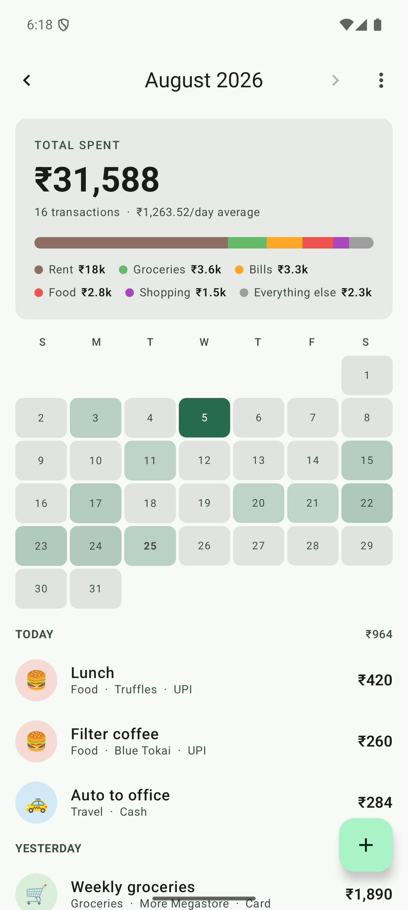
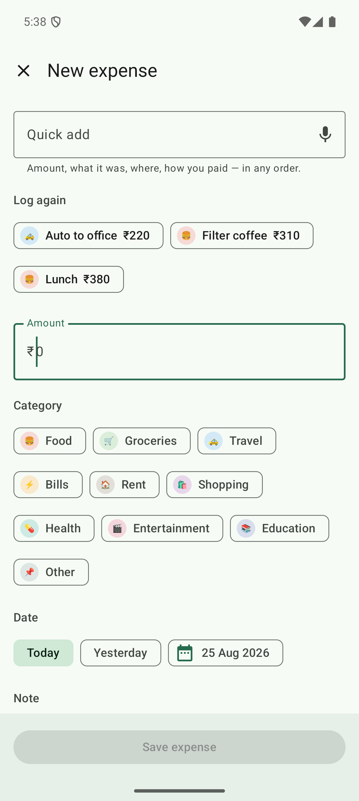
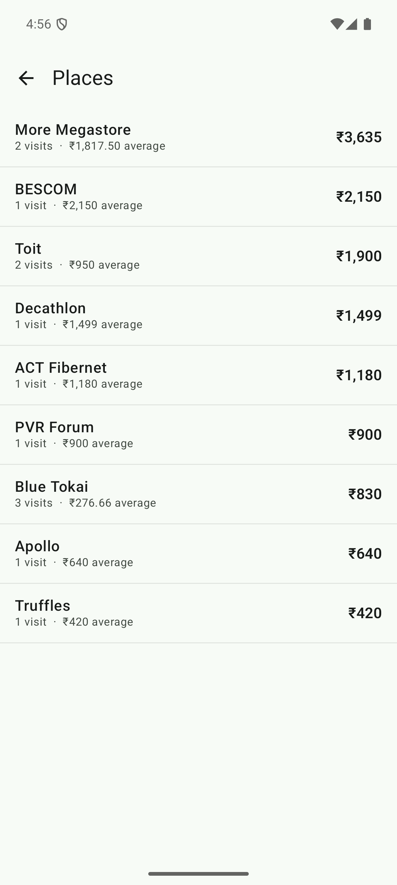

# Expense Tracker

A personal expense tracker for Android. You type in what you spent; it shows you where the money went.

Everything stays on the device. No account, no sync, no network permission.

| Home | Add | Places |
|---|---|---|
|  |  |  |

## What it does

**Log an expense.** Amount, category, date, note, merchant and payment method. The date starts on today, the payment method starts on whatever you used last, and the merchant field completes from places you have typed before.

**Three ways to skip the form.** Type or speak one line into Quick add (`284 auto cash`) and it fills the fields in. Tap a "Log again" chip for something you log often. Long-press the app icon for your top three repeats. All three fill the form and stop; nothing is written until you press save, because the auto ride that usually costs ₹220 sometimes costs ₹284.

**See the month.** A total with a category breakdown bar, a calendar tinted by daily spend, then every transaction grouped by day with a subtotal per day. Tap a day in the calendar to jump the feed to it.

**Follow the money to a place.** Long-press any row, or open Places, to see everything you have spent at one merchant: total, visit count, average, and the date range.

**Edit anything.** Tap a row to change it. Swipe left to delete, with undo. Categories can be renamed, recoloured, reordered and archived.

## Running it

Open the project in Android Studio and press Run. From the command line:

```bash
./gradlew :app:installDebug          # build and install on a connected device
./gradlew :app:testDebugUnitTest     # 78 JVM tests, no device needed
./gradlew :app:connectedDebugAndroidTest   # 26 tests, needs a device or emulator
```

Gradle needs a JDK 21. Android Studio ships one, so set `JAVA_HOME` to its bundled runtime if your shell has no JDK on the path:

```bash
export JAVA_HOME="/path/to/Android Studio/jbr"
```

Built against `compileSdk 35` with `minSdk 24`, so it runs on Android 7.0 and up.

## How it fits together

One module, no dependency injection framework. `AppContainer` builds the database once and hands out the single repository; `AppViewModelProvider` passes that repository to every ViewModel. Roughly 3,800 lines of Kotlin across 36 files.

```
data/       Room entities, DAOs, the repository, seed categories
ui/home/    summary card, month heatmap, grouped transaction feed
ui/entry/   add and edit form, quick-add parser
ui/merchant/  places list, per-merchant detail
ui/categories/  rename, recolour, reorder, archive
ui/format/  Money and DateLabels
```

DAOs return `Flow`. Each ViewModel combines those flows into one `StateFlow<UiState>`, and Compose collects it with `collectAsStateWithLifecycle`. Save an expense and the total, the breakdown bar, the heatmap and the feed all update on their own. Nothing refreshes anything manually.

Aggregation happens in SQL, not Kotlin. The category breakdown is a `SUM(...) GROUP BY categoryId`; the repeat suggestions are a `GROUP BY` over note, merchant, category and payment method. SQLite does the arithmetic.

## Data model

Two tables, currently at schema version 1. No migration has been needed yet: every feature since the first version has been a new query rather than a new column.

**`expenses`** — `id`, `amountMinor`, `categoryId`, `date`, `createdAt`, `note`, `merchant`, `paymentMethod`

**`categories`** — `id`, `name`, `emoji`, `colorArgb`, `sortOrder`, `isArchived`

Ten categories are seeded on first launch: Food, Groceries, Travel, Bills, Rent, Shopping, Health, Entertainment, Education, Other.

## Decisions worth knowing

**Money is paise in a `Long`.** Amounts held in a floating point type produce totals that are quietly wrong. Indian digit grouping (`₹1,00,000`) is written by hand in `Money.kt` rather than delegated to `NumberFormat`, so the JVM tests and the device produce identical strings whatever locale data is installed.

**Categories archive, never delete.** A foreign key with `RESTRICT` backs this up. Hide "Education" in December and last March still says Education.

**`date` and `createdAt` are different things.** `date` is the day you assign the expense to. `createdAt` exists only to order entries within a day and to work out which amount a repeat suggestion should offer.

**Quick add learns from your history.** There is no built-in dictionary. `auto` resolves to Travel because that is where you have always filed it, and merchants match against places you have actually typed. An empty history simply leaves those fields for you.

**Quick add takes the first number it sees.** `2 coffees 240` reads ₹2, not ₹240. Predictable beats clever when you can see the result before saving.

**`java.time` is marked stable.** `LocalDate` and `YearMonth` are immutable, but they live outside the module so the Compose compiler treats them as unstable. Left alone, that made all 42 heatmap cells recompose on every frame. `compose_stability.conf` fixes it, along with strong skipping mode.

## Tests

104 tests: 78 on the JVM, 26 on a device.

The JVM tests cover the parts where being wrong is expensive and a device adds nothing: money parsing and formatting, day and month labels, calendar-grid maths, expense grouping, the save-button rule, and 28 cases for the quick-add parser.

The instrumented tests run against real SQLite: month-boundary queries, category totals, archive behaviour, merchant aggregation, repeat-suggestion grouping, and restoring a deleted expense under its original id.

`FeedIndexTest` is a tripwire. Tapping a heatmap day scrolls the feed by computing an index, and that maths only holds while `HomeScreen` lays its list out the way the test expects. Add an item above the first day header and the test fails on purpose.

## Performance

The Compose compiler will tell you which composables cannot skip recomposition:

```bash
./gradlew :app:compileDebugKotlin
# then read app/build/compose-reports/app_debug-composables.txt
```

Every composable in the app currently skips. If you add one that does not, the report names the parameter responsible.

Judge smoothness on a release build. Debug Compose runs without R8 or a baseline profile and is far slower than what you would ship.

## Not built yet

Budgets, income, recurring expenses, CSV export and search are all deliberately absent. None is blocked by the schema: income is a sign change, budgets are one new table.

The other two ideas on the shelf are a Glance home-screen widget, which would show live totals rather than the static labels a launcher shortcut can carry, and a no-spend-day counter.
